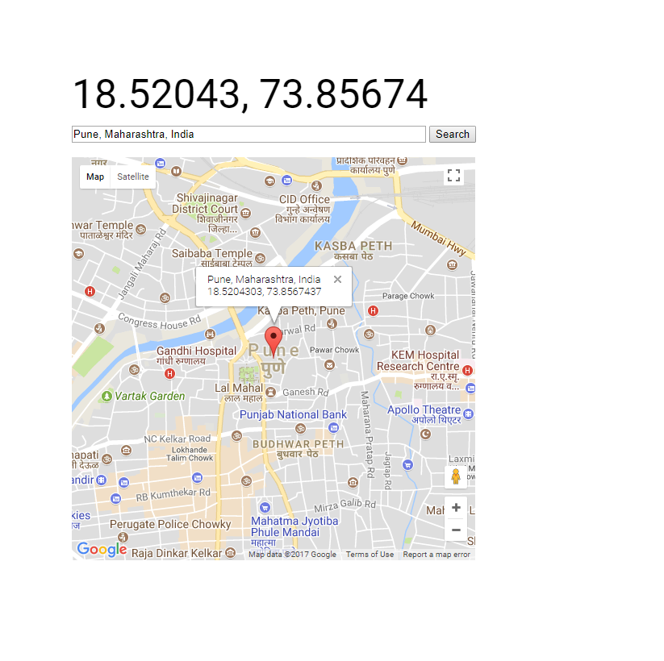

# Address-to-latlong


A simple program using Google Maps API to search & get the lat, long of location.


### Stuff used to make this


1. Google Maps API
2. Markers
3. Info Window
4. Autocomplete


### Environment setup

1. You will need to add the `key.json` file in `js` folder
2. `key.json` will contain following code

```
var mapsKey = {
	"key": "YOUR_GOOGLE_MAP_KEY"
};
```
3. Open the Web browser to `index.html`

### Preview 




### TODO


1. ~~On click of map lat, long should be displayed~~
2. Display info message after coping the coords to clipboard.
3. On enter press search results should be displayed.

